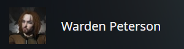
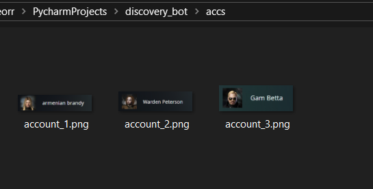

## Где взять путь к лаунчеру?
**вообще путь по умолчанию должен работать, если не работает то вот:**
1) Открываем лаунчер `EVE Online`
2) Открываем диспетчер задач
3) ПКМ по .exe => Открыть расположение файла

## Что за папка `accs`?
**очень важная папка для работы бота**
 - в ней лежат скрины ваших аккаунтов в лаунчере, скрины выглядят как то так:

 - каждый скрин называется `account_№.png`, где № - номер аккаунта
 - папка выглядит как то так (ток должно быть много аккаунтов чтоб много денег):

## Запуск бота
После установки и настройки просто запустите `run.bat`

## Обновление бота
Для обновления файлов бота запустите `update_files.bat` или `update_files_no_git.bat`

## Решение проблем
- **Бот не видит аккаунты**: Убедитесь, что в папке `accs` есть правильные скриншоты аккаунтов в нужном формате
- **Ошибки с detectron2**: Переустановите detectron2 из исходников
- **Ошибки с весами модели**: Проверьте, что весовые файлы находятся в папке `weights`

**Если всё равно чего-то не работает**, пишите мне в тг и кидайте все логи (в лаунчере есть окошко для вывода логов)
